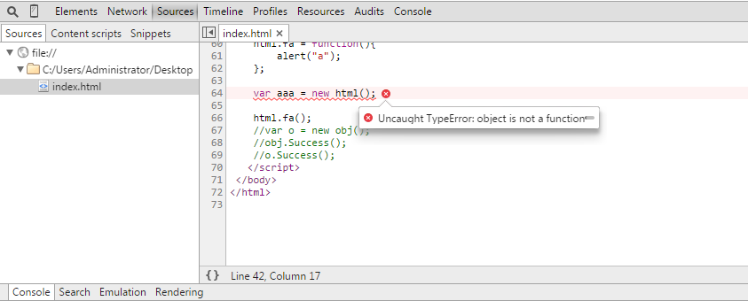

### 浅谈Javascript闭包和闭包的几种写法及用途

#### 一、什么是闭包和闭包的几种写法和用法

**1.什么是闭包**

闭包，官方对闭包的解释是：一个拥有许多变量和绑定了这些变量的环境的表达式（通常是一个函数），因而这些变量也是该表达式的一部分。闭包的特点：
- 作为一个函数变量的一个引用，当函数返回时，其处于激活状态。
- 一个闭包就是当一个函数返回时，一个没有释放资源的栈区。
  
简单的说，Javascript允许使用内部函数---即函数定义和函数表达式位于另一个函数的函数体内。而且，这些内部函数可以访问它们所在的外部函数中声明的所有局部变量、参数和声明的其他内部函数。当其中一个这样的内部函数在包含它们的外部函数之外被调用时，就会形成闭包。

#### 2、闭包的几种写法和用法

首先要明白，在JS中一切都是对象，函数是对象的一种。下面先来看一下闭包的5种写法，简单理解一下什么是闭包。后面会具体解释。
````
//第1种写法  
function Circle(r) {  
    this.r = r  
}  
Circle.PI = 3.14159
Circle.prototype.area = function () {  
  return Circle.PI * this.r * this.r  
}  
  
var c = new Circle(1.0)    
alert(c.area())
````
这种写法没什么特别的，只是给函数添加一些属性。
````
//第2种写法  
var Circle = function () {  
    var obj = new Object()  
    obj.PI = 3.14159
     
    obj.area = function ( r ) {  
        return this.PI * r * r  
    }  
    return obj
}  
  
var c = new Circle() 
alert( c.area( 1.0 ) )
````
这种写法是声明一个变量，将一个函数当作值赋给变量。
````
//第3种写法  
var Circle = new Object() 
Circle.PI = 3.14159
Circle.Area = function ( r ) {  
    return this.PI * r * r 
}  
  
alert( Circle.Area( 1.0 ) ) 
````
这种方法最好理解，就是new 一个对象，然后给对象添加属性和方法。
````
//第4种写法  
var Circle={  
    "PI": 3.14159,  
    "area": function (r) {  
        return this.PI * r * r
    }  
}
alert( Circle.area(1.0) )
````
这种方法使用较多，也最为方便。var obj = {}就是声明一个空的对象。
````
//第5种写法  
var Circle = new Function("this.PI = 3.14159;this.area = function( r ) {return r*r*this.PI;}")  
  
alert( (new Circle()).area(1.0) )
````

总的来说，上面几种方法，第2中和第4中较为常见，大家可以根据习惯选择。

上面代码中出现了JS中常用的Prototype，那么Prototype有什么用呢？下面我们来看一下：
````
    var dom = function () {
        
    }

    dom.Show = function () {
        alert("Show Message")
    }
    
    dom.prototype.Display = function () {
        alert("Property Message")
    }

    dom.Display() // error
    dom.Show()  
    var d = new dom()
    d.Display()
    d.Show() // error
````
我们首先声明一个变量，将一个函数赋给他，因为在Javascript中每个函数都有一个Portotype属性，而对象没有。添加两个方法，分别直接添加和添加打破Prototype上面，来看下调用情况。分析结果如下：

<font color="#f00">1、不使用prototype属性定义的对象方法，是静态方法，只能直接用类名进行调用！另外，此静态方法中无法使用this变量来调用对象其他的属性！</font>

<font color="#f00">2、使用prototype属性定义的对象方法，是非静态方法，只有在实例化后才能使用！其方法内部可以this来引用对象自身中的其他属性！</font>

下面我们再来看一段代码：
````
var dom = function () {
    var Name = "Default"
    this.Sex = "Boy"
    this.success = function(){
        alert("Success")
    }
}

alert(dom.Name)
alert(dom.Sex)
````
大家先看看，会显示什么呢？ 答案是两个都显示<font color="#f00">**Undefined**</font>,为什么呢？这是由于在Javascript中每个function都会形成一个作用域，而这些变量声明在函数中，所以就处于这个函数的作用域中，外部是无法访问的。要想访问变量，就必须new一个实例出来。
````
var html = {
    Name: 'Object',
    Success: function () {
        this.Say = function () {
            alert("Hello,world")
        }
        alert("Obj Success")
    }
}
````
再来看看这种写法，其实这是Javascript的一个"语法糖"，这种写法相当于：
````
var html = new Object()
html.Name = 'Object'
html.Success = function () {
    this.Say = function () {
        alert("Hello,world")
    }
    alert("Obj Success")
}
````
变量html是一个对象，不是函数，所以没有Prototype属性，其方法也都是公有方法，html不能被实例化。否则会出现如下错误：



但是他可以作为值赋给其它变量，如var o = html; 我们可以这样使用它：
````
alert(html.Name)
html.Success()
````
说到这里，完了吗？细心的人会问，怎么访问Success方法中的Say方法呢？是html.Success.Say()吗？

当然不是，上面刚说过由于作用域的限制，是访问不到的。所以要用下面的方法访问：
````
var s = new html.Success()
s.Say()

//还可以写到外面
html.Success.prototype.Show = function() {
    alert("HaHa")
}
var s = new html.Success()
s.Show()
````
#### 二、Javascript闭包的用途

事实上，通过使用闭包，我们可以做很多事情。比如模拟面向对象的代码风格；更优雅，更简洁的表达出代码；在某些方面提升代码的执行效率。

**1、匿名自执行函数**

我们知道所有的变量，如果不加上var关键字，则默认的会添加到全局对象的属性上去，这样的临时变量加入全局对象有很多坏处，
比如：别的函数可能误用这些变量；造成全局对象过于庞大，影响访问速度(因为变量的取值是需要从原型链上遍历的)。
除了每次使用变量都是用var关键字外，我们在实际情况下经常遇到这样一种情况，即有的函数只需要执行一次，其内部变量无需维护，
比如UI的初始化，那么我们可以使用闭包：
````
var data= {    
    table : [],    
    tree : {}    
} 
     
(function(dm){    
    for (var i = 0; i < dm.table.rows; i++) {    
       var row = dm.table.rows[i]    
       for (var j = 0; j < row.cells; i++) {    
           drawCell(i, j)   
       }    
    }         
})(data)
````
我们创建了一个匿名的函数，并立即执行它，由于外部无法引用它内部的变量，因此在函数执行完后会立刻释放资源，关键是不污染全局对象。

**2、结果缓存**

我们开发中会碰到很多情况，设想我们有一个处理过程很耗时的函数对象，每次调用都会花费很长时间，

那么我们就需要将计算出来的值存储起来，当调用这个函数的时候，首先在缓存中查找，如果找不到，则进行计算，然后更新缓存并返回值，如果找到了，直接返回查找到的值即可。闭包正是可以做到这一点，因为它不会释放外部的引用，从而函数内部的值可以得以保留。
````
var CachedSearchBox = (function () {  
    var cache = {}   
    var count = []   
    return {    
        attachSearchBox: function(dsid) {    
           if (dsid in cache) { // 如果结果在缓存中    
                return cache[dsid] // 直接返回缓存中的对象 
           }    
           var fsb = new uikit.webctrl.SearchBox(dsid) // 新建    
           cache[dsid] = fsb // 更新缓存    
           if (count.length > 100) { // 保正缓存的大小<=100    
                delete cache[count.shift()]   
           }    
           return fsb          
       } 
    
        clearSearchBox: function (dsid){    
            if (dsid in cache) {    
                cache[dsid].clearSelection()  
            }    
        }    
    }   
})() 
     
CachedSearchBox.attachSearchBox("input")   
````
这样我们在第二次调用的时候，就会从缓存中读取到该对象。

**3、封装**
````
var person = function () {    
    //变量作用域为函数内部，外部无法访问   
    var name = "default"  

    return {    
       getName: function () {    
           return name   
       },    
       setName: function (newName) {  
           name = newName   
       }    
    }    
}()   
     
console.log(person.name) // 直接访问，结果为undefined    
console.log(person.getName())    
person.setName("abruzzi")   
console.log(person.getName())  
   
得到结果如下：  
   
undefined  
default  
abruzzi  
````

**4、实现类和继承**
````
function Person () {    
    var name = "default"     
       
    return {    
        getName: function () {    
            return name   
        },    
        setName: function (newName) {
            name = newName    
        }    
    }    
} 

var p = new Person()
p.setName("Tom")
alert(p.getName())

var Jack = function () {}
//继承自Person
Jack.prototype = new Person()
//添加私有方法
Jack.prototype.Say = function () {
    alert("Hello,my name is Jack")
}

var j = new Jack()
j.setName("Jack")
j.Say()
alert(j.getName())
````
我们定义了Person，它就像一个类，我们new一个Person对象，访问它的方法。

下面我们定义了Jack，继承Person，并添加自己的方法。