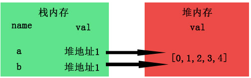
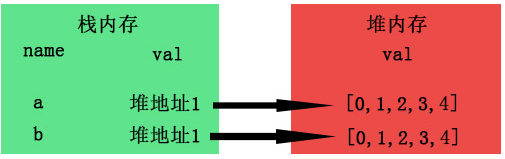

### 深拷贝与浅拷贝区别
#### 一、定义
**对象拷贝(Object Copy)就是将一个对象的属性拷贝到另一个有着相同类类型的对象中去。在程序中拷贝对象是很常见的，主要是为了在新的上下文环境中复用对象的部分或全部 数据。JavaScript中有两种类型的对象拷贝：浅拷贝(Shallow Copy)、深拷贝(Deep Copy)**。

1. 浅拷贝：只是拷贝了基本类型的数据，而引用类型数据，复制后也是会发生引用，我们把这种拷贝叫做“（浅复制）浅拷贝”，换句话说，引用数据类型，它的名存于栈中，值存于堆中，但是栈内存会提供一个引用的地址指向堆内存中的值。对象是引用类型，复制的是那个对象在栈中的引用地址而并非堆里面的值，这两个变量指向的是同一个对象。如下图：
   
    

2. 在堆内存中开辟了一块新的内存地址用于存放复制的对象。
   
    

#### 二、实现
1.怎么实现深拷贝？？？
- 法一：用JSON对象的parse和stringify
  ````
  function deepClone(obj) {
      let obj1 = JSON.stringify(obj)
      let objClone =JSON.parse(obj1)
      return objClone
  }
  ````
  <font color="#f00">**注意：拷贝对象里面不能有方法，只有属性，这个方案最优（此方法fun拷贝不了）**</font>

- 法二：递归原理
````
    function deepCopy (obj) {
        const objClone = Array.isArray(obj) ? [] || {}
        if (obj && typeof obj === 'object') {
            for (var key in obj) {
                if (obj.hasOwnProperty(key)) {
                    // 判断ojb子元素是否为对象，如果是，递归复制
                    if (obj[key] && typeof obj[key] === 'object') {
                        objClone[key] = deepCopy(obj[key])
                    } else { // 不是，简单复制
                        objClone[key] = obj[key]
                    } 
                }
            }
        }
        return objClone
    }
  ````
- 法三：JQ的extend方法
  ````
  let newObj = $.extend(true,{},partcontent)
  ````
  2.怎么实现浅拷贝
  ````
  function shallowCopy (obj) {
      let objClone = Array.isArray(obj) ? [] : {}
      if (obj && typeof obj === 'object') {
          for (let key in obj) {
              if (obj.hasOwnProperty(key)) {
                  objClone[key] = obj[key]
              }
          }
      }
      return objClone
  }
  ````