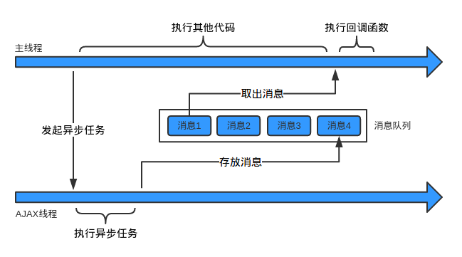

#### 彻底理解同步、异步和事件循环(Event Loop)
**一. 单线程**

我们常说“JavaScript是单线程的”。

所谓单线程，是指在JS引擎中负责解释和执行JavaScript代码的线程只有一个。不妨叫它主线程。但是实际上还存在其他的线程。例如：处理AJAX请求的线程、处理DOM事件的线程、定时器线程、读写文件的线程(例如在Node.js中)等等。这些线程可能存在于JS引擎之内，也可能存在于JS引擎之外，在此我们不做区分。不妨叫它们工作线程。

**二. 同步和异步**

假设存在一个函数A：
````
A(args...);
````
<font color="#f00">同步</font>：如果在函数A返回的时候，调用者就能够得到预期结果(即拿到了预期的返回值或者看到了预期的效果)，那么这个函数就是同步的。

例如：
````
Math.sqrt(2);
console.log('Hi');
````
第一个函数返回时，就拿到了预期的返回值：2的平方根。
第二个函数返回时，就看到了预期的效果：在控制台打印了一个字符串。
所以这两个函数都是同步的。

<font color="#f00">异步</font>：如果在函数A返回的时候，调用者还不能够得到预期结果，而是需要在将来通过一定的手段得到，那么这个函数就是异步的。

例如：
````
fs.readFile('foo.txt', 'utf8', function(err, data) {
    console.log(data);
});
````
在上面的代码中，我们希望通过fs.readFile函数读取文件foo.txt中的内容，并打印出来。
但是在fs.readFile函数返回时，我们期望的结果并不会发生，而是要等到文件全部读取完成之后。如果文件很大的话可能要很长时间。

下面以AJAX请求为例，来看一下同步和异步的区别：

异步AJAX：
````
主线程：“你好，AJAX线程。请你帮我发个HTTP请求吧，我把请求地址和参数都给你了。” 

AJAX线程：“好的，主线程。我马上去发，但可能要花点儿时间呢，你可以先去忙别的。”

主线程：：“谢谢，你拿到响应后告诉我一声啊。”(接着，主线程做其他事情去了。一顿饭的时间后，它收到了响应到达的通知。)
````
同步AJAX：
````
主线程：“你好，AJAX线程。请你帮我发个HTTP请求吧，我把请求地址和参数都给你了。”

AJAX线程：“......”

主线程：：“喂，AJAX线程，你怎么不说话？”

AJAX线程：“......”

主线程：：“喂！喂喂喂！”

AJAX线程：“......”(一炷香的时间后)

主线程：：“喂！求你说句话吧！”

AJAX线程：“主线程，不好意思，我在工作的时候不能说话。你的请求已经发完了，拿到响应数据了，给你。”
````
正是由于JavaScript是单线程的，而异步容易实现非阻塞，所以在JavaScript中对于耗时的操作或者时间不确定的操作，使用异步就成了必然的选择。

**三. 异步过程的构成要素**

从上文可以看出，异步函数实际上很快就调用完成了。但是后面还有工作线程执行异步任务、通知主线程、主线程调用回调函数等很多步骤。我们把整个过程叫做异步过程。异步函数的调用在整个异步过程中，只是一小部分。

总结一下，一个异步过程通常是这样的：

**主线程发起一个异步请求，相应的工作线程接收请求并告知主线程已收到(异步函数返回)；主线程可以继续执行后面的代码，同时工作线程执行异步任务；工作线程完成工作后，通知主线程；主线程收到通知后，执行一定的动作(调用回调函数)。**

异步函数通常具有以下的形式：
````
A(args..., callbackFn)
````
它可以叫做异步过程的发起函数，或者叫做异步任务注册函数。args是这个函数需要的参数。callbackFn也是这个函数的参数，但是它比较特殊所以单独列出来。

所以，从主线程的角度看，一个异步过程包括下面**两个要素**：
````
- 发起函数(或叫注册函数)A
  
- 回调函数callbackFn
````
  
它们都是在主线程上调用的，其中注册函数用来发起异步过程，回调函数用来处理结果。

举个具体的例子：
````
setTimeout(fn, 1000);
````
其中的setTimeout就是异步过程的发起函数，fn是回调函数。

注意：前面说的形式A(args..., callbackFn)只是一种抽象的表示，并不代表回调函数一定要作为发起函数的参数，例如：
````
var xhr = new XMLHttpRequest();
xhr.onreadystatechange = xxx; // 添加回调函数
xhr.open('GET', url);
xhr.send(); // 发起函数
````
发起函数和回调函数就是分离的。

**四. 消息队列和事件循环**

上文讲到，异步过程中，工作线程在异步操作完成后需要通知主线程。那么这个通知机制是怎样实现的呢？答案是利用**消息队列和事件循环。**

用一句话概括：

工作线程将消息放到消息队列，主线程通过事件循环过程去取消息。

- 消息队列：消息队列是一个先进先出的队列，它里面存放着各种消息。
- 事件循环：事件循环是指主线程重复从消息队列中取消息、执行的过程。
  
**实际上，主线程只会做一件事情，就是从消息队列里面取消息、执行消息，再取消息、再执行。当消息队列为空时，就会等待直到消息队列变成非空。而且主线程只有在将当前的消息执行完成后，才会去取下一个消息。这种机制就叫做事件循环机制，取一个消息并执行的过程叫做一次循环。**

事件循环用代码表示大概是这样的：
````
while(true) {
    var message = queue.get();
    execute(message);
}
````
那么，消息队列中放的消息具体是什么东西？消息的具体结构当然跟具体的实现有关，但是为了简单起见，我们可以认为：

消息就是注册异步任务时添加的回调函数。
再次以异步AJAX为例，假设存在如下的代码：
````
$.ajax('http://segmentfault.com', function(resp) {
    console.log('我是响应：', resp);
});

// 其他代码
...
...
...
````
主线程在发起AJAX请求后，会继续执行其他代码。AJAX线程负责请求segmentfault.com，拿到响应后，它会把响应封装成一个JavaScript对象，然后构造一条消息：
````
// 消息队列中的消息就长这个样子
var message = function () {
    callbackFn(response);
}
````
其中的callbackFn就是前面代码中得到成功响应时的回调函数。

主线程在执行完当前循环中的所有代码后，就会到消息队列取出这条消息(也就是message函数)，并执行它。到此为止，就完成了工作线程对主线程的通知，回调函数也就得到了执行。如果一开始主线程就没有提供回调函数，AJAX线程在收到HTTP响应后，也就没必要通知主线程，从而也没必要往消息队列放消息。

用图表示这个过程就是：



图片描述

从上文中我们也可以得到这样一个明显的结论，就是：

**异步过程的回调函数，一定不在当前这一轮事件循环中执行。**

**五. 异步与事件**

上文中说的“事件循环”，为什么里面有个事件呢？那是因为：

消息队列中的每条消息实际上都对应着一个事件。
上文中一直没有提到一类很重要的异步过程：DOM事件。

举例来说：
````
var button = document.getElement('#btn');
button.addEventListener('click', function(e) {
    console.log();
});
````
从事件的角度来看，上述代码表示：在按钮上添加了一个鼠标单击事件的事件监听器；当用户点击按钮时，鼠标单击事件触发，事件监听器函数被调用。

从异步过程的角度看，addEventListener函数就是异步过程的发起函数，事件监听器函数就是异步过程的回调函数。事件触发时，表示异步任务完成，会将事件监听器函数封装成一条消息放到消息队列中，等待主线程执行。

事件的概念实际上并不是必须的，事件机制实际上就是异步过程的通知机制。我觉得它的存在是为了编程接口对开发者更友好。

另一方面，所有的异步过程也都可以用事件来描述。例如：setTimeout可以看成对应一个时间到了！的事件。前文的setTimeout(fn, 1000);可以看成：
````
timer.addEventListener('timeout', 1000, fn);
````
**六. 生产者与消费者**

从生产者与消费者的角度看，异步过程是这样的：

工作线程是生产者，主线程是消费者(只有一个消费者)。工作线程执行异步任务，执行完成后把对应的回调函数封装成一条消息放到消息队列中；主线程不断地从消息队列中取消息并执行，当消息队列空时主线程阻塞，直到消息队列再次非空。

**七. 总结一下**

最后再用一个生活中的例子总结一下同步和异步：在公路上，汽车一辆接一辆，有条不紊的运行。这时，有一辆车坏掉了。假如它停在原地进行修理，那么后面的车就会被堵住没法行驶，交通就乱套了。幸好旁边有应急车道，可以把故障车辆推到应急车道修理，而正常的车流不会受到任何影响。等车修好了，再从应急车道回到正常车道即可。唯一的影响就是，应急车道用多了，原来的车辆之间的顺序会有点乱。

这就是同步和异步的区别。同步可以保证顺序一致，但是容易导致阻塞；异步可以解决阻塞问题，但是会改变顺序性。改变顺序性其实也没有什么大不了的，只不过让程序变得稍微难理解了一些 。

*PS：ECMAScript 262规范中，并没有对异步、事件队列等概念及其实现的描述。这些都是具体的JavaScript运行时环境使用的机制。本文重点是描述异步过程的原理，为了便于理解做了很多简化。所以文中的某些术语的使用可能是不准确的，具体细节也未必是正确的，例如消息队列中消息的结构。*