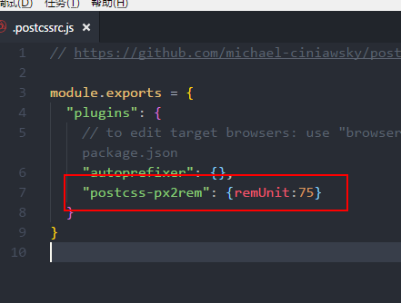
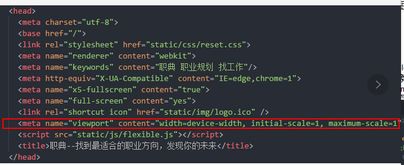

#### 手淘适配方案说明

直接引入flexible.js文件即可（设计稿按照750px切图）

注意：
1. flexible.js文件不要改动
2. postcssrc.js像以下配置（或者在vue-loader.conf.js文件里面配置，具体请百度）：单位就可以直接用px，会自动转化为rem。（可能会要求先安装postcss-plugin-px2rem插件，npm i post-plugin-px2rem即可）

3. 不要用fixed属性！ 不要用fixed属性！ 不要用fixed属性！
4. 在index.html里面的head标签里面加入meta标签，禁止缩放

