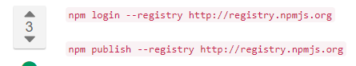
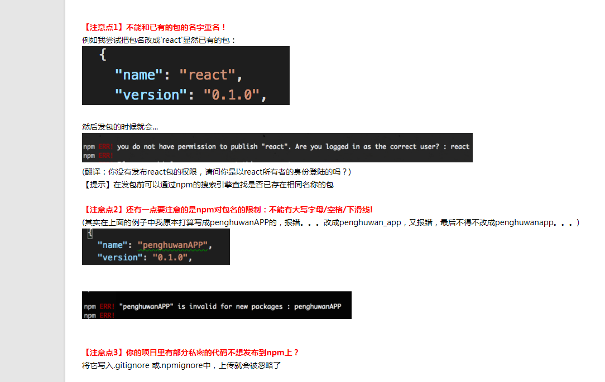

### 在npm上发布自己的包
1. npm init
2. npm login --registry http://registry.npmjs.org
3. npm publish --registry http://registry.npmjs.org

eg、发布一个名叫liuXiangInkTest的包
1.新建文件夹liuXiangInkTest
Mkdir liuXiangInkTest
Cd liuXiangInkTest
Npm init
npm login --registry http://registry.npmjs.org
npm publish --registry http://registry.npmjs.org

注意：删除已经发布的包：
npm unpublish liuXiangInkTest --force（半小时内删除有效）
其他命令：可用以下命令查看

Npm help

**命名规范：不能下划线/大写/空格，用中划线，如上面的规范写法
Liuxiang-ink-test或者liuxianginktest**
