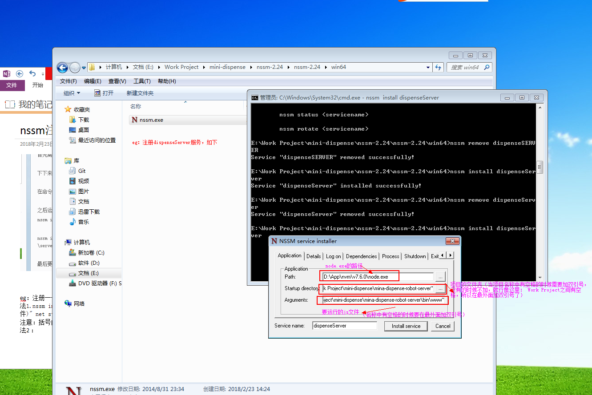
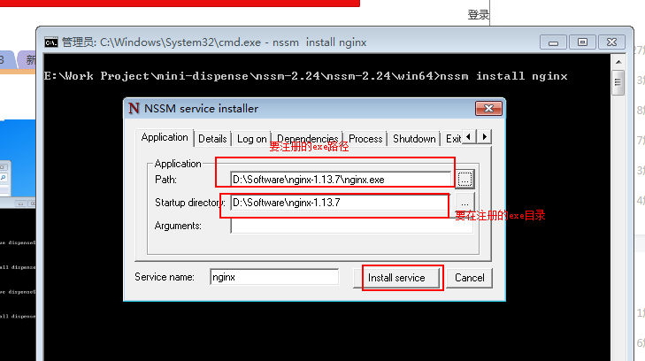

### 使用nssm将项目部署（注册）为windows服务

##### 简介
nssm是一款可将nodejs项目注册为windows系统服务的工具。
##### 特点
nssm将nodejs项目注册为服务后，启动、停止、重启借由windows来管理，使用我们不用担心，项目因意外停止，windows可自动监测并重启。
##### 使用
###### 一、nodejs项目注册为服务
1.下载nssm[地址](http://www.nssm.cc/release/nssm-2.24.zip)
2.解压，选择自己的平台（32或者64），在此目录下打开命令行（cmd，git bush，power shell都ok）
3.输入nssm install dispenseServer(dispenseServer即注册服务名称，可随便取)
4.弹出nssm界面

注意：Application标签设置：
A. Application Path:选择系统安装的node.exe
B. Startup directory: 选择nodejs项目的根目录
C. Arguments: 输入启动参数，即要运行的js文件（如默认的express项目的参数为./bin/www）
5.点击install serverice即可
###### 二、将exe文件注册为windows服务
eg：注册nginx
步骤同上，参数略有不同

最后启动服务：可命令启动：如nssm start nginx
也可手动启动
#### 常用命令
nssm start serverName 启动服务
nssm stop serverName 停止服务
nssm remove serverName 删除服务
#### 命令行注册
nssm install serverName "\node.exe(node.exe的安装地址）" "\server.js(要启动的js文件)" net start test(安装后立即启动)

