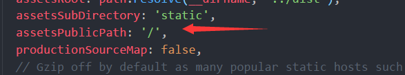
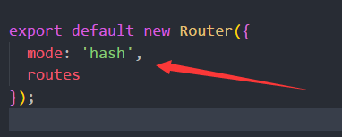

#### 怎么打开一个自己的网站
两种情况：
- 情况A：在同一个局域网里：
     1. 开启dev模式（npm run dev）
     2. 直接访问你的ip+端口号就ok了

- 情况B、不在同一个局域网里
1. 将'/'改成'./'
  
  

2. 路由改成hash模式
  
 
 
3. 打包（npm run build）
  
  以上是前端需要做的，后面就交给后台搭个服务器就行了！！！
