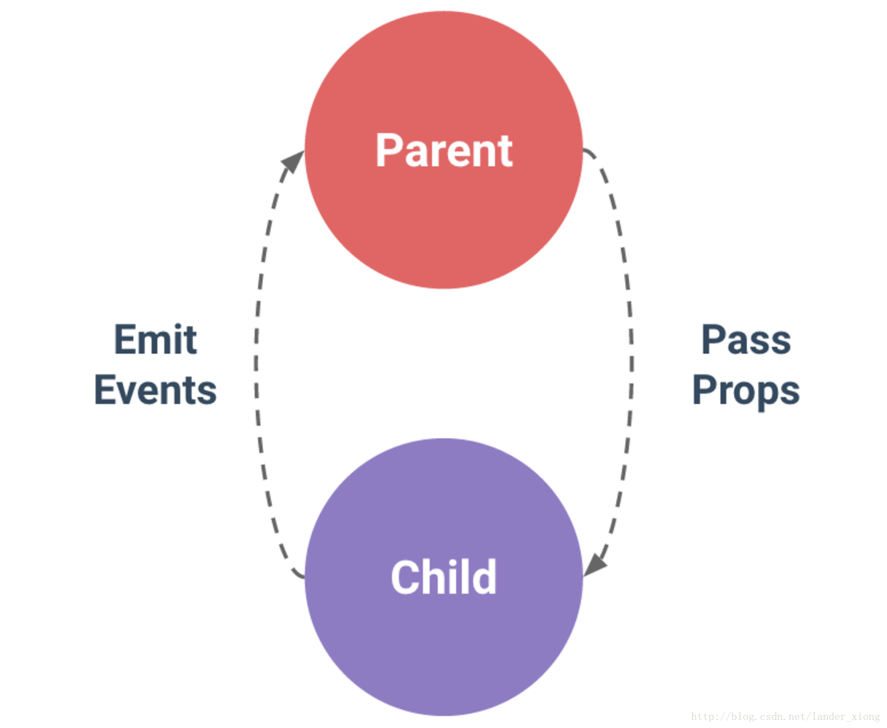

#### Vue2.0 传值方式：

在Vue的框架开发的项目过程中，经常会用到组件来管理不同的功能，有一些公共的组件会被提取出来。这时必然会产生一些疑问和需求？比如一个组件调用另一个组件作为自己的子组件，那么我们如何进行给子组件进行传值呢？如果是电商网站系统的开发，还会涉及到购物车的选项，这时候就会涉及到非父子组件传值的情况。当然也可以用Vuex状态管理工具来实现，先给大家介绍Vue开发中常用的三种传值方式。

**Vue常用的三种传值方式有：**
- 父传子
- 子传父
- 非父子传值

>引用官网的一句话：父子组件的关系可以总结为 prop 向下传递，事件向上传递。父组件通过 prop 给子组件下发数据，子组件通过事件给父组件发送消息，如下图所示：



<font color="#dd0000">1. 父组件向子组件进行传值</font>
   
   父组件：
````
<template>
  <div>
    <!-- 父组件: -->
    <input type="text" v-model="name">
    <br>
    <br>
    <!-- 引入子组件 -->
    <child :inputName="name"></child>
  </div>
</template>
<script>
  import child from './child'
  export default {
    components: {
      child
    },
    data () {
      return {
        name: ''
      }
    }
  }
</script>
````
子组件：
````
<template>
  <div>
    子组件:
    <span>{{inputName}}</span>
  </div>
</template>
<script>
  export default {
    // 接受父组件的值
    props: {
      inputName: String,
      required: true
    }
  }
</script>
````
<font color="#dd0000">2. 子组件向父组件传值</font>

子组件：
````
<template>
  <div>
    <!-- 子组件: -->
    <span>{{childValue}}</span>
     定义一个子组件传值的方法 -->
    <input type="button" value="点击触发" @click="childClick">
  </div>
</template>
<script>
  export default {
    data () {
      return {
        childValue: '我是子组件的数据'
      }
    },
    methods: {
      childClick () {
        // childByValue是在父组件on监听的方法
        // 第二个参数this.childValue是需要传的值
        this.$emit('childByValue', this.childValue)
      }
    }
  }
</script>
````
父组件：
````
<template>
  <div>
    <!-- 父组件: -->
    <span>{{name}}</span>
    <br>
    <br>
    <!-- 引入子组件 定义一个on的方法监听子组件的状态-->
    <child v-on:childByValue="childByValue"></child>
  </div>
</template>
<script>
  import child from './child'
  export default {
    components: {
      child
    },
    data () {
      return {
        name: ''
      }
    },
    methods: {
      childByValue: function (childValue) {
        // childValue就是子组件传过来的值
        this.name = childValue
      }
    }
  }
</script>
````
<font color="#dd0000">3. 非父子组件进行传值</font>

非父子组件之间传值，需要定义个公共的公共实例文件bus.js，作为中间仓库来传值，不然路由组件之间达不到传值的效果。

公共bus.js
````
//bus.js
import Vue from 'vue'
export default new Vue()
````
组件A：
````
<template>
  <div>
    A组件:
    <span>{{elementValue}}</span>
    <input type="button" value="点击触发" @click="elementByValue">
  </div>
</template>
<script>
  // 引入公共的bug，来做为中间传达的工具
  import Bus from './bus.js'
  export default {
    data () {
      return {
        elementValue: 4
      }
    },
    methods: {
      elementByValue: function () {
        Bus.$emit('val', this.elementValue)
      }
    }
  }
</script>
````
组件B：
````
<template>
  <div>
    B组件:
    <input type="button" value="点击触发" @click="getData">
    <span>{{name}}</span>
  </div>
</template>
<script>
  import Bus from './bus.js'
  export default {
    data () {
      return {
        name: 0
      }
    },
    mounted: function () {
      var vm = this
      // 用$on事件来接收参数
      Bus.$on('val', (data) => {
        console.log(data)
        vm.name = data
      })
    },
    methods: {
      getData: function () {
        this.name++
      }
    }
  }
</script>
````