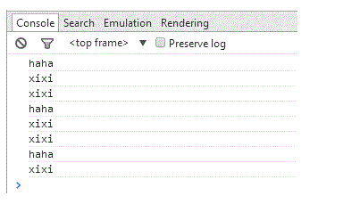
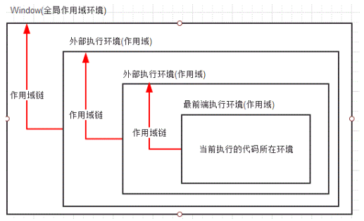

### JavaScript中作用域和作用域链的简单理解（变量提升）

#### 一、执行环境（execution context）

　　执行环境定义了变量和函数有权访问的其他数据，决定了他们各自的行为。每个执行环境都有与之对应的变量对象（variable object），保存着该环境中定义的所有变量和函数。我们无法通过代码来访问变量对象，但是解析器在处理数据时会在后台使用到它。

　　执行环境有全局执行环境（也称全局环境）和函数执行环境之分。执行环境如其名是在运行和执行代码的时候才存在的，所以我们运行浏览器的时候会创建全局的执行环境，在调用函数时，会创建函数执行环境。

**1.1 全局执行环境**

　　全局执行环境是最外围的一个执行环境，在web浏览器中，我们可以认为他是window对象，因此所有的全局变量和函数都是作为window对象的属性和方法创建的。代码载入浏览器时，全局环境被创建，关闭网页或者关闭浏览时全局环境被销毁。

**1.2 函数执行环境**

　　每个函数都有自己的执行环境，当执行流进入一个函数时，函数的环境就被推入一个环境栈中，当函数执行完毕后，栈将其环境弹出，把控制权返回给之前的执行环境。

#### 二、 作用域、作用域链
**2.1 全局作用域（globe scope）和局部作用域（local scope）**

　　全局作用域可以在代码中的任何地方都能被访问，例如：

````
var name1 = "haha"
function changName () {
    var name2 = "xixi"
    console.log(name1) // haha
    console.log(name2) // xixi
} 
changName()
console.log(name1) // haha
console.log(name2) // Uncaught ReferenceError: name2 is not defined
````
　　其中，name1具有全局作用域，因此在第4行和第8行都会在控制台上输出 haha。name2定义在changName()函数内部，具有局部作用域，因此在第9行，解析器找不到变量name2，抛出错误。

　　另外，在函数中声明变量时，如果省略 var 操作符，那么声明的变量就是全局变量，拥有全局作用域，但是不推荐这种做法，因为在局部作用域中很难维护定义的全局变量。

　　再者，window对象的内置属性都拥有全局作用域。

 　 局部作用域一般只在固定的代码片段内可以访问得到，例如上述代码中的name2，只有在函数内部可以访问得到。

**2.2 作用域链（scope chain）**

    全局作用域和局部作用域中变量的访问权限，其实是由作用域链决定的。

　　每次进入一个新的执行环境，都会创建一个用于搜索变量和函数的作用域链。作用域链是函数被创建的作用域中对象的集合。作用域链可以保证对执行环境有权访问的所有变量和函数的有序访问。

　　作用域链的最前端始终是当前执行的代码所在环境的变量对象（如果该环境是函数，则将其活动对象作为变量对象），下一个变量对象来自包含环境（包含当前还行环境的环境），下一个变量对象来自包含环境的包含环境，依次往上，直到全局执行环境的变量对象。全局执行环境的变量对象始终是作用域链中的最后一个对象。

　　标识符解析是沿着作用域一级一级的向上搜索标识符的过程。搜索过程始终是从作用域的前端逐地向后回溯，直到找到标识符（找不到，就会导致错误发生）。

例如：
````
 var name1 = "haha"
 function changeName () {
    var name2 = "xixi"
    function swapName () {
        console.log(name1) // haha
        console.log(name2) // xixi
        var tempName = name2
        name2 = name1
        name1 = tempName
        console.log(name1) // xixi
        console.log(name2) // haha
        console.log(tempName) // xixi
   }
    swapName()
    console.log(name1) // haha
    console.log(name2) // xixi
    //console.log(tempName) // 抛出错误：Uncaught ReferenceError: tempName is not defined
 }
changeName()
console.log(name1)
//console.log(name2) // 抛出错误：Uncaught ReferenceError: name2 is not defined
//console.log(tempName) // 抛出错误：Uncaught ReferenceError: tempName is not defined
````
 运行结果如下：




上述代码中，一共有三个执行环境：全局环境、changeName()的局部环境和 swapName() 的局部环境。所以，

- 函数 swapName()的作用域链包含三个对象：自己的变量对象----->changeName()局部环境的变量对象 ----->全局环境的变量对象。
- 函数changeName()的作用域包含两个对象：自己的变量对象----->全局环境的变量对象。

就上述程序中出现的变量和函数来讲（不考虑隐形变量）：

1. swapName() 局部环境的变量对象中存放变量 tempName；
2. changeName() 局部环境的变量对象中存放变量 name2 和 函数swapName()；
3. 全局环境的变量对象中存放变量 name1 、函数changeName();

　　在swapName()的执行环境中，在执行第5句代码时，解析器沿着函数 swapName()的作用域链一级级向后回溯查找变量 name1，直到在全局环境中找到变量 name1.并输出在控制台上。同样，在执行第6句代码时，解析器沿着函数 swapName()的作用域链一级级向后回溯，在函数changeName()的变量对象中发现变量 name2.通过代码对 name1 和 name2进行交换，并输出在控制台上，根据结果我们发现，这两个变量的值确实交换了。因此我们可以得出结论，函数的局部环境可以访问函数作用域中的变量，也可以访问和操作父环境（包含环境）乃至全局环境中的变量。

　　在changeName() 的执行环境中，执行第15行和第16行代码时，可以正确地输出  name1 和 name2 和两个变量的值（调用了函数swapName(),所以俩变量的值已相互交换），那是因为 name1 在changName()的父环境（全局环境）中， name2 在他自己的局部环境中，即 name1 和 name2 都在其作用域链上。但当执行第17行代码是发生错误 tempName is not defined。因为解析器沿着 函数changeName()的作用域链一级级的查找 变量 tempName时，并不能找到该变量的存在（变量 tempName不在其作用域链上），所以抛出错误。因此，我们可以得出结论：父环境只能访问其包含环境和自己环境中的变量和函数，不能访问其子环境中的变量和函数。

　　同理，在全局环境中，其变量对象中只存放变量 name1 、函数changeName();  解析器只能访问变量 name1 和函数 changeName(), 而不能访问和操作 函数 changeName() 和函数 swapName() 中定义的变量或者函数。因此，在执行第21行和第22行代码时抛出变量没有定义的错误。所以说，全局环境只能访问全局环境中的变量和函数，不能直接访问局部环境中的任何数据。

　　其实，我们可以把作用域链想象成这样（里面的能访问外面的，外面的不能访问里面的，图为参考）： 



**作用域链相关知识的总结：**
1. 执行环境决定了变量的生命周期，以及哪部分代码可以访问其中变量
2. 执行环境有全局执行环境（全局环境）和局部执行环境之分。
3. 每次进入一个新的执行环境，都会创建一个用于搜索变量和函数的作用域链
4. 函数的局部环境可以访问函数作用域中的变量和函数，也可以访问其父环境，乃至全局环境中的变量和环境。
5. 全局环境只能访问全局环境中定义的变量和函数，不能直接访问局部环境中的任何数据。
6. 变量的执行环境有助于确定应该合适释放内存。

#### 三、提升（hoisting）

提升有变量提升和函数提升之分，下面我们依次介绍他们。

**3.1 变量提升（variable hoisting）**

请看一下代码：
````
var name = "haha"
function changeName () {
   console.log(name)
   var name = "xixi"
}
changeName()
console.log(name)
````
大家认为第6行和第7行代码输出的结果应该是什么？好了，答案是：输出结果结果分别是 undefined 和 haha。为什么是undefined？ 按照作用域链的思路思考，输出的结果应该是 haha或者xixi啊？ （当然大家都知道 xixi是不可能的，因为解析器在解析第3行代码时，还不知道第4行中的赋值内容）。

　　那我们先来分析一下代码 函数changeName() 的作用域链： 自己的变量对象 -----> 全局变量对象。解析器在函数执行环境中发现变量 name，因此不会再向全局环境的变量对象中寻找。但是大家要注意的是，解析器在解析第3句代码时，还不知道变量name的值，也就是说只知道有变量name，但是不知道它具体的值（因为还没有执行第4句代码），因此输出是 undefined，第7行输出haha大家应该都理解把（作用域问题）。所以上述代码可以写成下面的形式：
````
var name = "haha"
function changeName () {
    var name
    console.log(name)
    name = "xixi"
}
changeName()
console.log(name)
````
这个现象就是变量提升！

　　**变量提升，就是把变量提升到函数的顶部，需要注意的是，变量提升只是提升变量的声明，不会吧变量的值也提升上来！**

最常见的代码如下，函数example1()和函数example2()是等价的：
````
function example1 () {
    var a = "haha"
    var b = "xixi"
    var c = "heihei"
}
function example2 () {
    var a, b, c
    a = "haha"
    b = "xixi"
    c = "heihei"
}
````
**3.2 函数提升（）**

　　函数提升就是把函数提升到前面。

　　在JavaScript中函数的创建方式有三种：函数声明（静态的，像函数example1()的形式）、函数表达式（函数字面量）、函数构造法（动态的，匿名的）。函数表达式的形式如下：
````
var func1 = function (n1, n2) {
    // function body
}
````
函数构造法构造函数的形式如下：
````
 var func2 = new Function("para1", "para2", ..., "function body")
 ```` 
在这里需要说明的是：只有函数声明形式才能被提升！例如：
````
//函数声明
function myTest1 () { 
    func()
    function func () { 
        console.log("我可以被提升") 
    } 
} 
myTest1()

//函数表达式
function myTest2 () { 
    func()
    var func = function () { 
        console.log("我不能被提升")
    }
} 
myTest2()
````
控制台显示结果如下：

