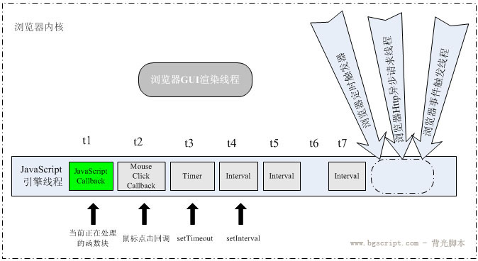

#### JavaScript定时器原理分析

JavaScript中的定时器大家基本在平时的开发中都遇见过吧，但是又有多少人去深入的理解其中的原理呢？下面我们就来分析一下定时器的实现原理。

**一、储备知识**

在我们在项目中一般会遇见过这样的两种定时器，第一种是setTimeOut,第二种是setInterval，这两种定时器有如下的区别：
1. setTimeout允许设置一个超时对象，超时后执行这个对象，但是只执行一次，无周期
2. setInternval允许设置一个超时对象，超时后执行这个对象，周期等于超时对象指定的时间，周期为无限循环

举一个简单的例子来说明一下：
````
<!DOCTYPE html>
<html lang="en">
<head>
    <meta charset="UTF-8">
    <title>blog案例</title>
</head>
<body>
    <script type="text/javascript">
        setTimeout("alert('this is test')", 2000)
        setInterval("console.log('demo')", 1000)
    </script>
</body>
</html> 
````
这个运行后的结果是弹出了一次对话框，然后在控制台可以看到每1秒钟会向其中输出demo字样

**二、定时器原理初识**

那么问题来了，如下的代码运行的时候会出现什么情况呢？
````
<!DOCTYPE html>
<html lang="en">
<head>
    <meta charset="UTF-8">
    <title>blog案例</title>
</head>
<body>
    <script type="text/javascript">
        setTimeout("alert('定时器!')",0)
        alert("测试")
    </script>
</body>
</html>
````
是先执行alert("测试")，还是先执行alert("定时器")呢，那么我们就来运行一下吧！

运行后的结果是先弹出测试字样的弹出框，然后才弹出定时器字样的弹出框，为什么会这样呢？不是定时器的时间为0就即可执行吗？

答案不是这样的，因为JS众所周知是单线程的，所以很多人会认为在上面的例子中会先阻塞等待定时器执行完成后再执行下面的语句，但是这个也就是单线程的一个缺陷之一吧，为了解决这个问题，引入了异步机制。异步机制主要是利用一个我们平时很少去关注的一个知识点——浏览器的多线程。究竟什么是浏览器的多线程呢？

**三、浏览器的多线程**

 这里我们就来讲解一下，众所周知，JS是单线程的，但是对于浏览器来说JS的执行只不过是在浏览器众多现成中的一条，我们称之为JS引擎线程。而浏览器的其他线程则是通过JS引擎线程在执行到某个特定的功能之后指定给浏览器的对应线程。具体的原理详见图示：



从这张图我们可以知道JS引擎线程首先执行回调函数块，然后是执行点击事件回调，接着是执行定时器的线程，最后在执行其他的线程。

以下面的代码我们来分析一下：
````
setTimeout("alert('定时器!')",0)
alert("测试")
````
首先JS线程读取到setTimeout定时器，这个时候就会执行浏览器的线程，然后跳过定时器继续执行，这个时候你就看到了弹出框的内容为测试，然后因为定时器的时间为0，所以一执行定时器线程就会即可将弹出框为定时器字样的任务添加到主线程（JS引擎线程）的队列之后，等待JS引擎的调用，这个时候我们看到的结果是先弹出测试，然后再弹出定时器

另外我们要注意在HTML5规范中规定定时器的定时时间不能小于4ms，如果是小于4ms，则默认为4ms，所以在这个例子中的0，默认的是4ms，但是这个在不通过的浏览器中的表现是不同的，但是这个一般在项目中是没有什么印象的，这个只是仅做了解即可。

好的我们将上面的代码改写成这样，然后我们再来看看效果：
````
<script type="text/javascript">
    console.time("test")
    setTimeout("for(var i=0; i<1000; i++)console.log('定时器!')", 1000)
    console.log("测试")
    console.timeEnd("test")
</script>
````
这里有几个知识点：

1. console.time和console.timeEnd这两个方法是可以获取在其中间执行的语句所用的时间，从图中我们可以知道test执行的时间在1ms左右，然而定时器的定时时间是在1000ms左右所以这两个语句只能计算当前引擎的执行时间，换句话说就是在浏览器中的定时器模块的运行时间是这样是没法计算的
2. 另外我们可以看到一个现象就是定时器在执行的时候不是一千个定时器的字样全都一次性的打印出来，而是几百几百的增加，这个是为什么呢？这里就涉及到了另外的一个问题，如果是定时器的时间到了，但是定时器中的任务没有执行完成这个时候会怎样？

我们上面说过就是定时器的时间到了的情况下，就会向JS引擎线程添加任务，不论任务里面的语句是否执行完成，都会像JS引擎线程队列中添加，但是剩下的未执行完成的语句怎么办呢？

程序执行到了定时器任务的时候，就会先把已经在定时器模块执行过的语句加载一次，然后是继续执行定时器模块的剩余语句。(定时器模块向JS引擎中添加的任务相当于就是C语言中的一个指针，指向的是定时器模块)

所以，setTimeout我们可以定义为：

**<font color="red">在指定时间内, 将任务放入事件队列,等待js引擎空闲后被执行.</font>**

**四、setInterval的使用**

setInterval最基础的使用方法是直接当一个循环定时器使用，这里就不举例说明

对于setInterval(fn, 100)容易产生一个误区：并不是上一次fn执行完了之后再过100ms才开始执行下一次fn。 事实上，setInterval并不管上一次fn的执行结果，而是每隔100ms就将fn放入主线程队列，而两次fn之间具体间隔多久就不一定了，跟setTimeout实际延迟时间类似，和JS执行情况有关。具体的延迟效果与内存等因素有关。

**五、定时器的可靠性**

虽说定时器在大部分的情况下都是趋于稳定的，但是定时器在使用的时候也存在着一些误差

如下所示：
```
<script type="text/javascript">
    var time1 = new Date().getTime()
    setInterval(function(){
        var time2 = new Date().getTime()
        console.log("setInterval执行的差值时间：" + (time2 - time1))
    }, 1000)
</script>
````
运行的结果如下：

从图中我们基本可以看出定时器存在着一些小小的误差就比如第一次的运行时间为1001ms比我们设定的时间多出了1ms，所以得出结论：定时器不是完全的可靠的，存在极小的误差。这个还是在chrome浏览器上面测试的结果，换是在IE浏览器测试那又如何呢?(暂时不上图)结果显示，在IE浏览器下面的误差更大

**六、定时器的妙用**

 定时器在项目中除了可以作为定时的作用外还可以用来做耗时代码的优化：

 我们假设有这样的一个场景，就是在某个页面中要渲染50万个节点，这个时候对于一般的项目中，直接渲染是不可取的，因为这个时候会占用过多的内存，导致浏览器出现了卡死的状态，用户误以为是页面卡死而  直接关闭浏览器或者杀死进程，即使是用户不关闭页面这样给用户的体验也是不好的，这个时候我们要怎样来解决这个问题呢，我们可以利用定时器来优化这个问题首先我们可以把50万个节点分成多组，每组渲染  的节点数不要过多，然后通过setInterval来进行循环这个既不阻塞JS引擎线程的运行，又不可以提高渲染的消耗时间。从而达到最终的优化渲染。

**七、定时器使用注意事项**

 如果是项目中有对个定时器的参与那么记得在一个定时器执行结束的时候记得要调用clearInterval或clearTimeout这两个方法来清除定时器，以免定时器之间互相干扰出现一些抓摸不定的现象!!!